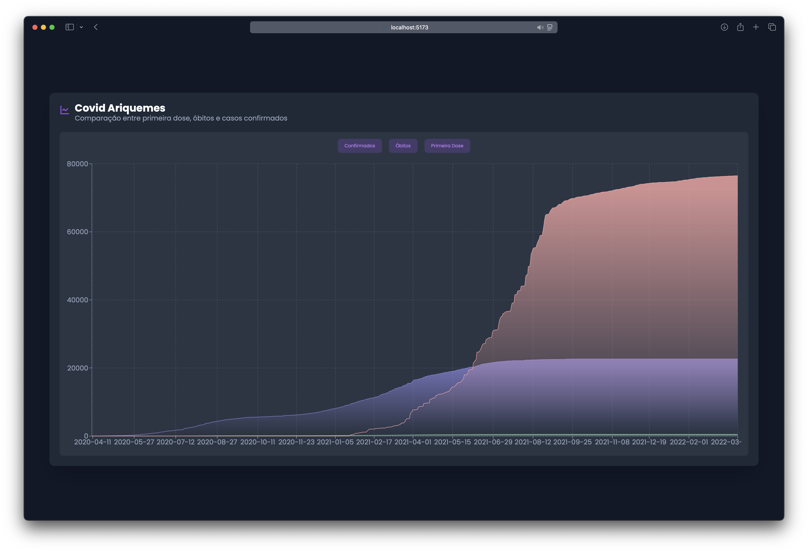

# Descrição do Projeto

Este projeto visa extrair e compilar dados da COVID-19 para a cidade de **Ariquemes**, gerando gráficos comparativos de casos confirmados, óbitos e doses de vacina aplicadas (especialmente a primeira dose). A estrutura de pastas está dividida em:

- **covid/**: Aplicação front-end (React/Vite) que consome o arquivo `merged_data.json` e exibe o gráfico na página principal.
- **extractData/**: Scripts Node.js responsáveis por:
  - Ler arquivos CSV massivos com informações de vacinação.
  - Filtrar apenas os registros de Ariquemes.
  - Gerar arquivos intermediários de dados (JSON).
  - Realizar compilações e merges para formar o arquivo final consumido pela aplicação front-end.



## Fonte

site do governo [https://dados.gov.br/dados/conjuntos-dados/covid-19-vacinacao1](https://dados.gov.br/dados/conjuntos-dados/covid-19-vacinacao1)

brasil.io [https://brasil.io/dataset/covid19/caso_full](https://brasil.io/dataset/covid19/caso_full/)

## Estrutura de Pastas

```
.
├── caso_full.csv
├── covid
│ ├── README.md
│ ├── eslint.config.js
│ ├── index.html
│ ├── package.json
│ ├── public
│ │ └── merged_data.json
│ ├── src
│ │ ├── App.tsx
│ │ ├── chart.tsx
│ │ ├── data
│ │ ├── main.css
│ │ ├── main.tsx
│ │ ├── reset.css
│ │ └── vite-env.d.ts
│ ├── tsconfig.app.json
│ ├── tsconfig.json
│ ├── tsconfig.node.json
│ ├── vite.config.ts
│ └── yarn.lock
└── extractData
├── compiled_summary.js
├── data
│ ├── inputs
│ │ ├── part-01-RO.csv
│ │ ├── part-02-RO.csv
│ │ ├── part-03-RO.csv
│ │ ├── part-04-RO.csv
│ │ └── part-05-RO.csv
│ └── output
│ ├── compiled.json
│ ├── compiled_summary.json
│ ├── data.json
│ ├── first_dose_summary.json
│ └── merged_data.json
├── extract.js
├── mergeData.js
├── package.json
└── vacina.js

```

## Scripts e Fluxo de Dados

A seguir, a descrição de cada script presente na pasta **extractData/** e o fluxo de dados gerado:

1. **`extract.js`**

   - **Objetivo**: Ler o arquivo `caso_full.csv` e gerar um arquivo `data.json` com os dados de casos confirmados e óbitos, organizados por data.
   - **Entrada**: `caso_full.csv`.
   - **Saída**: `./data/output/data.json`.

2. **`vacina.js`**

   - **Objetivo**: Ler os arquivos CSV gigantes na pasta `data/inputs` (`part-01-RO.csv`, `part-02-RO.csv`, etc.) e filtrar apenas os registros referentes ao município de **Ariquemes**. Em seguida, salva esses registros em um único arquivo JSON.
   - **Entrada**: `part-01-RO.csv` até `part-05-RO.csv`.
   - **Saída**: `./data/output/compiled.json`.

3. **`compiled_summary.js`**

   - **Objetivo**: A partir do arquivo `compiled.json`, gera dois novos arquivos:
     - `compiled_summary.json`: Resumo das doses aplicadas por dia, categorizadas em 1ª, 2ª, 3ª e 4ª doses, além do total por fabricante.
     - `first_dose_summary.json`: Resumo **apenas** das 1ª doses por dia.
   - **Entrada**: `./data/output/compiled.json`.
   - **Saídas**:
     - `./data/output/compiled_summary.json`
     - `./data/output/first_dose_summary.json`

4. **`mergeData.js`**
   - **Objetivo**: Ler o `data.json` (gerado pelo `extract.js`) e o `first_dose_summary.json` (gerado pelo `compiled_summary.js`) para, então, calcular o **acumulado** de 1ª dose por dia.
   - **Processo**:
     - Ordena as datas de `data.json` em ordem crescente.
     - Para cada data, soma a quantidade de 1ª dose do `first_dose_summary.json` (se existir) a um acumulador.
     - Adiciona essa informação ao registro do dia, resultando em um campo `first_dose_cumulative`.
   - **Saída**: `./data/output/merged_data.json`, que passa a conter:
     - `date`
     - `amount_confirmed`
     - `amount_deaths`
     - `first_dose_cumulative` (acumulado de primeira dose até aquela data)

## Front-End

Na pasta **covid/**, temos uma aplicação React (configurada com Vite) que carrega o arquivo `merged_data.json` (copiado ou referenciado em `covid/public/`) e exibe um gráfico que compara, ao longo do tempo, as curvas de:

- Casos confirmados
- Óbitos
- Total de 1ª dose aplicada (acumulada)

## Passo a Passo para Execução

1. **Instalar dependências (pasta `extractData`)**

```bash
cd extractData
npm install
```

2. **Gerar `data.json` (casos confirmados e óbitos)**

```bash
node extract.js
```

3. **Gerar `compiled.json` (registros de Ariquemes dos CSVs)**

```bash
node vacina.js
```

4. **Gerar `compiled_summary.json` e `first_dose_summary.json`**

```bash
node compiled_summary.js
```

5. **Mesclar `data.json` + `first_dose_summary.json`** para gerar `merged_data.json`

```bash
node mergeData.js
```

6. **Rodar a aplicação front-end (pasta `covid`)**

```bash
cd ../covid
yarn install
yarn dev
# ou npm install / npm run dev
```

Abra o navegador em http://localhost:5173 (ou a porta informada) para visualizar o gráfico.

## Observações

- Caso você queira atualizar os dados, basta repetir o processo.
- O arquivo `merged_data.json` é o resultado final que consolida tanto os dados de casos/óbitos quanto a contagem cumulativa de 1ª dose.
- O front-end lê esse arquivo e gera o gráfico que você vê na interface.
